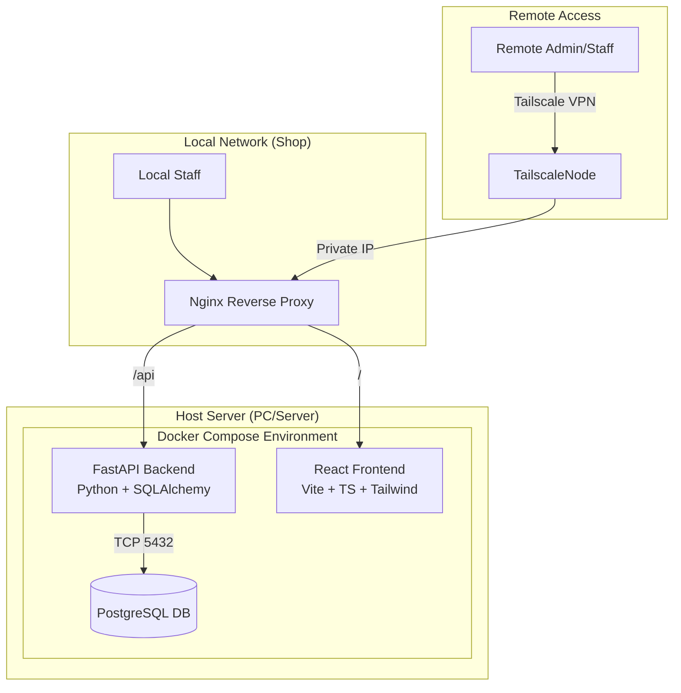
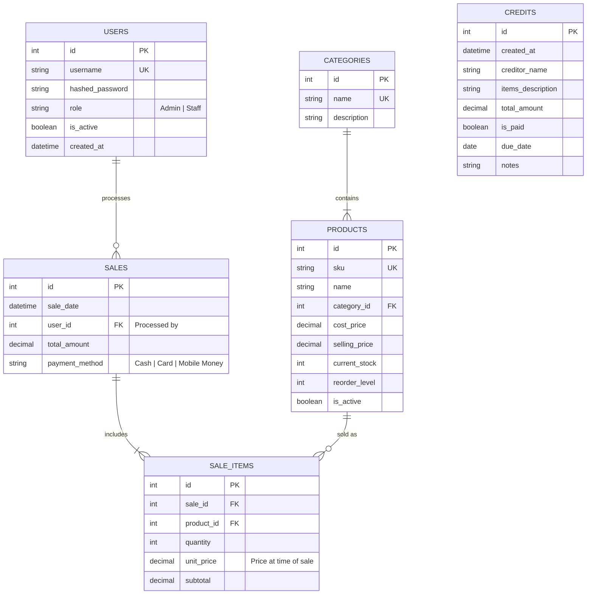
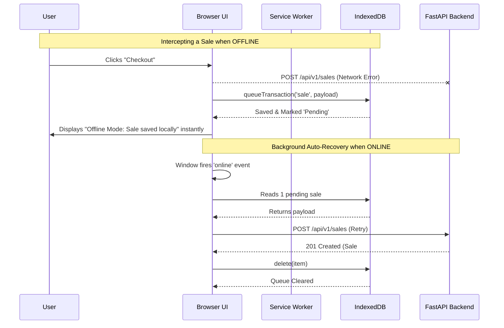

# Inventory and Sales Management System Design

## 1. System Architecture Diagram

The system is designed for local on-premises deployment, containerized with Docker, and accessible remotely via Tailscale VPN.



## 2. Database Schema Design (ERD)



## 3. Offline PWA Sync Architecture

A key feature of the POS system is its ability to withstand internet/network outages without blocking sales flow. It uses a Progressive Web App (PWA) architecture powered by Vite Workbox and Dexie (IndexedDB).



## 3. Folder Structure

The project will follow a monolithic repository structure, separating frontend and backend but deployed together via Docker Compose.

```text
shoptrack-pos/
├── backend/
│   ├── app/
│   │   ├── api/                # API routers/endpoints
│   │   │   └── v1/
│   │   ├── core/               # App config, security/JWT logic
│   │   ├── db/                 # Database connection and session
│   │   ├── models/             # SQLAlchemy ORM models
│   │   ├── schemas/            # Pydantic validation schemas
│   │   ├── services/           # Business logic (e.g., checkout)
│   │   └── main.py             # FastAPI entry point
│   ├── alembic/                # Database migrations
│   ├── tests/                  # Pytest unit and integration tests
│   ├── requirements.txt        # Python dependencies
│   ├── .env.example            # Backend environment variables
│   └── Dockerfile              # Backend container image
├── frontend/
│   ├── src/
│   │   ├── assets/             # Images, static files
│   │   ├── components/         # Reusable UI components (Buttons, Modals)
│   │   ├── pages/              # Route views (Dashboard, POS, Inventory)
│   │   ├── services/           # Axios/Fetch API client wrappers
│   │   ├── store/              # State management (Zustand/Redux)
│   │   ├── types/              # TypeScript interfaces
│   │   └── App.tsx             # Main React component
│   ├── package.json            # Node dependencies
│   ├── .env.example            # Frontend environment variables
│   ├── vite.config.ts          # Vite build config
│   └── Dockerfile              # Frontend container image (Nginx build)
├── nginx/
│   └── default.conf            # Nginx config for routing
├── docker-compose.yml          # Container orchestration
└── README.md                   # Setup documentation
```

## 4. API Endpoint Definitions

A clean RESTful API namespace structure under `/api/v1/`.

| Method | Endpoint | Role | Description |
|---|---|---|---|
| **Auth** | | | |
| POST | `/auth/login` | Public | Authenticate user, return JWT. |
| **Users** | | | |
| GET | `/users` | Admin | List all users. |
| POST | `/users` | Admin | Create a new user (Staff/Admin). |
| PUT | `/users/{id}` | Admin | Update user details or role. |
| **Categories** | | | |
| GET | `/categories` | Staff | List all product categories. |
| POST | `/categories` | Admin | Create a new category. |
| **Products** | | | |
| GET | `/products` | Staff | List products (with search/filters). |
| POST | `/products` | Admin | Add a new product to inventory. |
| PUT | `/products/{id}` | Admin | Update product details. |
| GET | `/products/low-stock`| Admin | Get products below reorder level. |
| **Sales** | | | |
| POST | `/sales` | Staff | Record a new sale & deduct stock. |
| GET | `/sales` | Admin | View transaction history & filters. |
| GET | `/sales/{id}` | Staff | Receipt details for a specific sale. |
| **Credits** | | | |
| GET | `/credits` | Staff | List outstanding or paid credit sales. |
| POST | `/credits` | Staff | Record a new unpaid credit sale. |
| PUT | `/credits/{id}` | Admin | Mark credit as paid or update details. |
| DELETE | `/credits/{id}` | Admin | Delete a credit record. |
| **Analytics** | | | |
| GET | `/analytics/dashboard`| Admin | Daily revenue, total sales, etc. |

## 5. Database Models (FastAPI + SQLAlchemy)

```python
from sqlalchemy import Column, Integer, String, Numeric, Boolean, ForeignKey, DateTime
from sqlalchemy.orm import relationship
from datetime import datetime
from app.db.base_class import Base

class User(Base):
    __tablename__ = 'users'
    id = Column(Integer, primary_key=True, index=True)
    username = Column(String, unique=True, index=True, nullable=False)
    hashed_password = Column(String, nullable=False)
    role = Column(String, default='staff') # 'admin' or 'staff'
    is_active = Column(Boolean, default=True)
    
    sales = relationship("Sale", back_populates="user")

class Category(Base):
    __tablename__ = 'categories'
    id = Column(Integer, primary_key=True, index=True)
    name = Column(String, unique=True, index=True, nullable=False)
    
    products = relationship("Product", back_populates="category")

class Product(Base):
    __tablename__ = 'products'
    id = Column(Integer, primary_key=True, index=True)
    sku = Column(String, unique=True, index=True, nullable=False)
    name = Column(String, index=True, nullable=False)
    category_id = Column(Integer, ForeignKey('categories.id'))
    cost_price = Column(Numeric(10, 2), nullable=False)
    selling_price = Column(Numeric(10, 2), nullable=False)
    current_stock = Column(Integer, default=0)
    reorder_level = Column(Integer, default=5)
    
    category = relationship("Category", back_populates="products")

class Sale(Base):
    __tablename__ = 'sales'
    id = Column(Integer, primary_key=True, index=True)
    sale_date = Column(DateTime, default=datetime.utcnow)
    user_id = Column(Integer, ForeignKey('users.id'))
    total_amount = Column(Numeric(10, 2), nullable=False)
    payment_method = Column(String) # 'Cash', 'Mobile Money', etc.
    
    user = relationship("User", back_populates="sales")
    items = relationship("SaleItem", back_populates="sale")

class SaleItem(Base):
    __tablename__ = 'sale_items'
    id = Column(Integer, primary_key=True, index=True)
    sale_id = Column(Integer, ForeignKey('sales.id'))
    product_id = Column(Integer, ForeignKey('products.id'))
    quantity = Column(Integer, nullable=False)
    unit_price = Column(Numeric(10, 2), nullable=False)
    subtotal = Column(Numeric(10, 2), nullable=False)
    
    sale = relationship("Sale", back_populates="items")
    product = relationship("Product")
```

## 6. Step-by-step Setup Instructions

### Prerequisites
- PC or Server running Ubuntu/Debian/Windows (WSL2)
- Docker and Docker Compose installed
- Tailscale account

### Step 1: Network Configuration (Tailscale)
1. Install Tailscale on the host machine where the server will run.
2. Authenticate the host with your Tailscale network.
3. Note the Tailscale IP of the host machine (e.g., `100.x.y.z`).
4. Install Tailscale on any remote devices (phones, laptops) that need access.

### Step 2: Code Automation & Deployment
1. Clone the repository to the host server.
   ```bash
   git clone <repo-url> shoptrack-pos
   cd shoptrack-pos
   ```
2. Copy the example environment variables.
   ```bash
   cp backend/.env.example backend/.env
   cp frontend/.env.example frontend/.env
   ```
3. Edit the `.env` files (Set DB passwords, JWT secret keys, and frontend API URL `VITE_API_URL=http://<tailscale-ip>/api`).
4. Build and start the containers.
   ```bash
   docker-compose up -d --build
   ```

### Step 3: Database Initialization
1. Run SQLAlchemy migrations to create the database tables.
   ```bash
   docker-compose exec backend alembic upgrade head
   ```
2. (Optional) Run a seed script to create the initial default Admin user.
   ```bash
   docker-compose exec backend python app/seed.py
   ```

### Step 4: Accessing the Application
- Open a browser on a device connected to the Tailscale network.
- Navigate to `http://<tailscale-ip>`.

## 7. Example Analytics Queries (SQL)

**1. Daily Sales Report (Revenue & Count):**
```sql
SELECT 
    DATE(sale_date) as day, 
    COUNT(id) as total_transactions,
    SUM(total_amount) as total_revenue
FROM sales
WHERE DATE(sale_date) = CURRENT_DATE
GROUP BY day;
```

**2. Top 5 Selling Products (By Quantity):**
```sql
SELECT 
    p.name, 
    SUM(si.quantity) as total_sold
FROM sale_items si
JOIN products p ON si.product_id = p.id
GROUP BY p.name
ORDER BY total_sold DESC
LIMIT 5;
```

**3. Low Stock Alerts:**
```sql
SELECT sku, name, current_stock, reorder_level
FROM products
WHERE current_stock <= reorder_level AND is_active = true;
```

**4. Profit Calculation (Monthly):**
```sql
SELECT 
    DATE_TRUNC('month', s.sale_date) as month,
    SUM(si.subtotal) as total_revenue,
    SUM(si.quantity * p.cost_price) as total_cost,
    SUM(si.subtotal) - SUM(si.quantity * p.cost_price) as gross_profit
FROM sales s
JOIN sale_items si ON s.id = si.sale_id
JOIN products p ON si.product_id = p.id
GROUP BY month
ORDER BY month DESC;
```

## 8. Security Considerations

- **VPN Only Exposure:** By avoiding port-forwarding on the router and mapping ports solely to Tailscale (or just keeping it local), the app protects against public internet attacks.
- **JWT Authentication:** Stateful sessions shouldn't be required. Generate short-lived access tokens (15 mins) and long-lived refresh tokens (7 days). Store tokens securely on the frontend.
- **Role-Based Access Control (RBAC):** Backend route dependencies must strictly verify role claims. A staff member should never be able to access `POST /api/products` or `GET /api/users`.
- **Database Safety:** Prevent destructive drops. Implement soft-deletes (`is_active` flag) instead of hard `DELETE` commands for products to keep historical sales data intact.
- **SQL Injection Prevention:** SQLAlchemy ORM inherently parameterizes queries, preventing standard SQL injection.
- **Automated Backups:** Use a cron job on the host machine to run `pg_dump` daily and store the dump securely in a remote location (e.g., AWS S3).

## 9. Future Scalability Suggestions

If the business grows beyond a single location or requires more complex background jobs:

1. **Multi-Tenant Architecture:** Rather than a single shop's scope, add a `store_id` to `users`, `products`, and `sales` to support multiple branches within a single database.
2. **Read/Write DB Replicas:** If querying analytics becomes slow, deploy a PostgreSQL replica. Route `GET /analytics` traffic to the replica to take load off the main transaction database.
3. **Caching Layer (Redis):** If the product catalog becomes massive, querying it repeatedly slows the POS. Incorporate Redis to cache category catalogs and speed up search.
4. **Message Queues:** Offload computationally heavy tasks like generating large PDF reports or firing low-stock email alerts to background workers (Celery + RabbitMQ/Redis).
